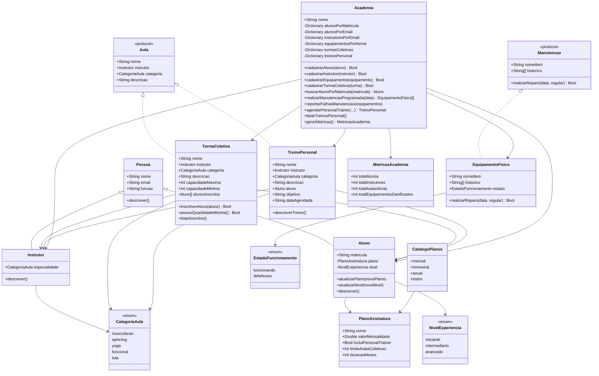

# Sistema de Gerenciamento de Academia em Swift

## Link do repositório

**GitHub:** coloque aqui o link do projeto  
`https://github.com/joanascheer/PreparandoAmbienteSwift`

---

## Descrição do projeto

Este projeto simula um sistema de gerenciamento de academia desenvolvido em **Swift**, com foco na aplicação de conceitos de programação orientada a objetos, tipos de valor, protocolos, encapsulamento, polimorfismo e organização de regras de negócio.

O sistema permite cadastrar alunos, instrutores, planos de assinatura, equipamentos físicos, turmas coletivas e treinos com personal trainer. Além disso, possui uma central de gerenciamento da academia responsável por controlar os cadastros, evitar duplicidades, executar manutenções programadas e validar regras de negócio, como a autorização para uso de personal trainer conforme o plano do aluno.

---

## Etapas do desenvolvimento

### Primeira etapa: fundações do domínio

Na primeira etapa foram criados os domínios fechados do sistema usando `enum`.

Foram criados:

```swift
enum NivelExperiencia
enum CategoriaAula
```

Esses enums representam valores fixos do sistema, como os níveis do aluno:

- Iniciante;
- Intermediário;
- Avançado.

E as categorias de aula:

- Musculação;
- Spinning;
- Yoga;
- Funcional;
- Luta.

Também foi criada a entidade `PlanoAssinatura`, contendo os dados principais de um plano:

```swift
struct PlanoAssinatura
```

Ela possui:

- nome;
- valor da mensalidade;
- indicação se inclui personal trainer;
- limite de aulas coletivas;
- duração em meses.

O catálogo de planos foi simulado em memória por meio da estrutura:

```swift
struct CatalogoPlanos
```

Nela foram criados os planos:

- Mensal;
- Trimestral;
- Anual.

Também foi criada a hierarquia base de pessoas:

```swift
class Pessoa
class Aluno: Pessoa
class Instrutor: Pessoa
```

A classe `Pessoa` concentra os atributos comuns, como nome, e-mail e função. As classes `Aluno` e `Instrutor` herdam de `Pessoa`, reaproveitando a estrutura principal.

---

### Segunda etapa: contratos de comportamento

Na segunda etapa foram aplicados protocolos para representar contratos de comportamento.

O primeiro contrato criado foi:

```swift
protocol Manutencao
```

Esse protocolo exige que qualquer item com manutenção tenha:

```swift
var nomeItem: String { get }
var historico: [String] { get }
mutating func realizarReparo(data: String, regular: Bool) -> Bool
```

A entidade que implementa esse contrato é:

```swift
struct EquipamentoFisico: Manutencao
```

Ela representa equipamentos físicos da academia, como esteira, bicicleta ergométrica e aparelhos de musculação.

Também foi criado o enum:

```swift
enum EstadoFuncionamento
```

Ele define se o equipamento está:

- funcionando;
- defeituoso.

A regra aplicada foi: se o equipamento estiver defeituoso, a manutenção falha obrigatoriamente.

---

### Terceira etapa: contratos para aulas

A arquitetura das aulas foi feita usando protocolo, evitando herança clássica.

O contrato criado foi:

```swift
protocol Aula
```

Ele exige:

```swift
var nome: String { get }
var instrutor: Instrutor { get }
var categoria: CategoriaAula { get }
var descricao: String { get }
```

Duas entidades independentes assinam esse contrato:

```swift
class TurmaColetiva: Aula
class TreinoPersonal: Aula
```

A `TurmaColetiva` controla inscrições de alunos, capacidade máxima e capacidade mínima. Ela impede:

- inscrição duplicada do mesmo aluno;
- inscrição acima da capacidade máxima.

A `TreinoPersonal` representa um treino individual com instrutor e aluno, contendo objetivo, descrição e data agendada.

---

### Quarta etapa: central de gerenciamento da academia

A classe principal do sistema é:

```swift
class Academia
```

Ela funciona como a fachada do domínio, centralizando o gerenciamento de:

- alunos;
- instrutores;
- equipamentos;
- turmas coletivas;
- treinos com personal trainer.

Para permitir consultas rápidas e evitar duplicidades, foram usados dicionários:

```swift
fileprivate var alunosPorMatricula: [String: Aluno]
fileprivate var alunosPorEmail: [String: Aluno]
fileprivate var instrutoresPorEmail: [String: Instrutor]
fileprivate var equipamentosPorNome: [String: EquipamentoFisico]
fileprivate var turmasColetivas: [String: TurmaColetiva]
fileprivate var treinosPersonal: [String: TreinoPersonal]
```

Essas estruturas funcionam como um banco de dados em memória baseado em chave-valor.

---

## Onde cada exigência foi aplicada no código

### 1. Domínios fechados

**Exigência:** criar conjuntos fechados para nível de experiência e categorias de aula.

Aplicado em:

```swift
enum NivelExperiencia: String
enum CategoriaAula: String
```

Esses enums impedem valores inválidos, pois o sistema só aceita os casos definidos.

---

### 2. Planos de assinatura

**Exigência:** criar entidade com nome, valor, personal trainer, limite de aulas e duração.

Aplicado em:

```swift
struct PlanoAssinatura
```

E o catálogo em memória foi aplicado em:

```swift
struct CatalogoPlanos
```

Os planos criados foram:

```swift
CatalogoPlanos.mensal
CatalogoPlanos.trimestral
CatalogoPlanos.anual
```

---

### 3. Hierarquia de pessoas

**Exigência:** criar entidade genérica `Pessoa` e derivar `Aluno` e `Instrutor`.

Aplicado em:

```swift
class Pessoa
class Aluno: Pessoa
class Instrutor: Pessoa
```

A classe `Aluno` adiciona matrícula, plano e nível.  
A classe `Instrutor` adiciona especialidade.

---

### 4. Atualização dinâmica de aluno

**Exigência:** alunos devem poder ter plano e nível atualizados dinamicamente.

Aplicado nos métodos:

```swift
func atualizarPlano(_ novoPlano: PlanoAssinatura)
func atualizarNivel(_ novoNivel: NivelExperiencia)
```

Esses métodos estão dentro da classe `Aluno`.

---

### 5. Contrato de manutenção

**Exigência:** criar contrato de manutenção com nome do item, histórico e ação de reparo.

Aplicado em:

```swift
protocol Manutencao
```

A implementação concreta foi feita em:

```swift
struct EquipamentoFisico: Manutencao
```

---

### 6. Falha obrigatória em equipamento defeituoso

**Exigência:** se o equipamento estiver defeituoso, a tentativa de manutenção deve falhar.

Aplicado dentro do método:

```swift
mutating func realizarReparo(data: String, regular: Bool) -> Bool
```

Neste trecho:

```swift
if estado == .defeituoso {
    let registro = "Data: \(data) | Falha na manutenção | Equipamento defeituoso"
    historico.append(registro)
    return false
}
```

Quando o equipamento está defeituoso, o método retorna `false`.

---

### 7. Contrato base de Aula

**Exigência:** abandonar herança clássica e criar contrato base `Aula`.

Aplicado em:

```swift
protocol Aula
```

As classes que assinam esse contrato são:

```swift
class TurmaColetiva: Aula
class TreinoPersonal: Aula
```

---

### 8. Controle de inscrições em turma coletiva

**Exigência:** inscrição só pode ocorrer se houver vaga e se o aluno ainda não estiver na turma.

Aplicado em:

```swift
func inscreverAluno(_ aluno: Aluno) -> Bool
```

O bloqueio de aluno repetido ocorre aqui:

```swift
if alunosInscritos.contains(where: { $0.matricula == aluno.matricula }) {
    print("Aluno \(aluno.nome) já está inscrito na turma \(nome).")
    return false
}
```

O bloqueio de superlotação ocorre aqui:

```swift
if alunosInscritos.count >= capacidadeMaxima {
    print("Não há vagas disponíveis na turma \(nome).")
    return false
}
```

---

### 9. Central da academia

**Exigência:** criar classe de gerenciamento central da academia.

Aplicado em:

```swift
class Academia
```

Essa classe agrega alunos, instrutores, equipamentos, turmas e treinos.

---

### 10. Armazenamento por chave-valor

**Exigência:** utilizar estruturas de dados baseadas em chave-valor para consulta rápida dos usuários matriculados.

Aplicado principalmente em:

```swift
fileprivate var alunosPorMatricula: [String: Aluno]
fileprivate var alunosPorEmail: [String: Aluno]
```

Com isso, a busca por matrícula é feita diretamente:

```swift
func buscarAlunoPorMatricula(_ matricula: String) -> Aluno?
```

---

### 11. Proteção contra duplicidades

**Exigência:** impedir matrículas ou e-mails já existentes.

Aplicado em:

```swift
func cadastrarAluno(_ aluno: Aluno) -> Bool
```

A duplicidade de matrícula é verificada neste trecho:

```swift
if alunosPorMatricula[aluno.matricula] != nil {
    print("Erro: já existe aluno cadastrado com a matrícula \(aluno.matricula).")
    return false
}
```

A duplicidade de e-mail é verificada neste trecho:

```swift
if alunosPorEmail[aluno.email] != nil || instrutoresPorEmail[aluno.email] != nil {
    print("Erro: já existe usuário cadastrado com o e-mail \(aluno.email).")
    return false
}
```

---

### 12. Manutenção programada em lote

**Exigência:** iterar sobre os equipamentos e reportar apenas máquinas que falharem.

Aplicado em:

```swift
func realizarManutencaoProgramada(data: String) -> [EquipamentoFisico]
```

Esse método percorre todos os equipamentos cadastrados e retorna somente os que falharam.

O relatório é feito por:

```swift
func reportarFalhasManutencao(_ equipamentosComFalha: [EquipamentoFisico])
```

---

### 13. Agendamento de personal trainer

**Exigência:** permitir personal trainer apenas se o plano do aluno autorizar.

Aplicado em:

```swift
func agendarPersonalTrainer(...)
```

A regra principal está neste trecho:

```swift
if !aluno.plano.incluiPersonalTrainer {
    print("Erro: o plano \(aluno.plano.nome) do aluno \(aluno.nome) não autoriza personal trainer.")
    return nil
}
```

Somente alunos com plano que possui:

```swift
incluiPersonalTrainer: true
```

podem agendar personal.

No catálogo atual, o plano que permite personal é o:

```swift
CatalogoPlanos.anual
```

---

## Roteiro prático de integração

O roteiro de execução foi criado no final do arquivo `main.swift`.

Ele instancia a central da academia:

```swift
let academia = Academia(nome: "Academia Vida Ativa")
```

Depois popula a memória com instrutores:

```swift
let instrutoraYoga = Instrutor(...)
let instrutorMusculacao = Instrutor(...)
let instrutorLuta = Instrutor(...)
```

E alunos em diferentes planos e níveis:

```swift
let aluno1 = Aluno(... plano: CatalogoPlanos.mensal, nivel: .iniciante)
let aluno2 = Aluno(... plano: CatalogoPlanos.trimestral, nivel: .intermediario)
let aluno3 = Aluno(... plano: CatalogoPlanos.anual, nivel: .avancado)
let aluno4 = Aluno(... plano: CatalogoPlanos.anual, nivel: .intermediario)
```

O roteiro testa as rejeições solicitadas.

### Duplicação de cadastro

Testada com aluno de matrícula duplicada:

```swift
let alunoMatriculaDuplicada = Aluno(
    nome: "Aluno Duplicado",
    email: "duplicado@email.com",
    matricula: "A001",
    plano: CatalogoPlanos.mensal,
    nivel: .iniciante
)

academia.cadastrarAluno(alunoMatriculaDuplicada)
```

E com e-mail duplicado:

```swift
let alunoEmailDuplicado = Aluno(
    nome: "Outro Bruno",
    email: "bruno@email.com",
    matricula: "A005",
    plano: CatalogoPlanos.mensal,
    nivel: .iniciante
)

academia.cadastrarAluno(alunoEmailDuplicado)
```

---

### Superlotação de turma

Testada na turma `Yoga Matinal`, com capacidade máxima 2:

```swift
let turmaYoga = TurmaColetiva(
    nome: "Yoga Matinal",
    instrutor: instrutoraYoga,
    categoria: .yoga,
    descricao: "Aula coletiva de yoga para respiração, flexibilidade e equilíbrio.",
    capacidadeMaxima: 2,
    capacidadeMinima: 1
)
```

Depois são feitas tentativas de inscrição:

```swift
turmaYoga.inscreverAluno(aluno1)
turmaYoga.inscreverAluno(aluno2)
turmaYoga.inscreverAluno(aluno3)
```

A terceira tentativa deve ser recusada porque a turma já está cheia.

---

### Aluno repetido na turma

Testado com:

```swift
turmaYoga.inscreverAluno(aluno1)
```

A segunda inscrição do mesmo aluno é recusada.

---

### Uso de benefício incompatível

Testado ao tentar agendar personal para Bruno, que possui plano Trimestral:

```swift
academia.agendarPersonalTrainer(
    matriculaAluno: "A002",
    emailInstrutor: "carlos@email.com",
    nomeTreino: "Treino de Força Individual",
    categoria: .musculacao,
    descricao: "Treino individual focado em força e condicionamento físico.",
    objetivo: "Ganhar força muscular",
    dataAgendada: "02/05/2026"
)
```

Como o plano Trimestral não inclui personal, o sistema rejeita.

---

### Equipamento enguiçado

Os equipamentos defeituosos foram criados assim:

```swift
let bicicleta = EquipamentoFisico(
    nomeItem: "Bicicleta Ergométrica",
    estado: .defeituoso
)

let sacoDePancada = EquipamentoFisico(
    nomeItem: "Saco de Pancada",
    estado: .defeituoso
)
```

Depois a manutenção global identifica as falhas:

```swift
let equipamentosComFalha = academia.realizarManutencaoProgramada(
    data: "01/05/2026"
)

academia.reportarFalhasManutencao(equipamentosComFalha)
```

Apenas os equipamentos defeituosos aparecem no relatório de falhas.

---

## Demonstração de polimorfismo

Para a defesa técnica, o projeto demonstra polimorfismo com duas coleções heterogêneas.

### Primeira coleção: pessoas

Como `Aluno` e `Instrutor` herdam de `Pessoa`, é possível criar uma coleção com os dois tipos juntos:

```swift
let pessoas: [Pessoa] = [
    aluno1,
    aluno2,
    aluno3,
    aluno4,
    instrutoraYoga,
    instrutorMusculacao,
    instrutorLuta
]

for pessoa in pessoas {
    pessoa.descrever()
    print("----------------")
}
```

Nesse caso, o método `descrever()` é chamado em cada objeto. Mesmo a variável sendo do tipo `Pessoa`, o Swift executa a versão correta do método conforme o tipo real do objeto.

Se for aluno, executa:

```swift
override func descrever()
```

da classe `Aluno`.

Se for instrutor, executa:

```swift
override func descrever()
```

da classe `Instrutor`.

---

### Segunda coleção: aulas

Como `TurmaColetiva` e `TreinoPersonal` implementam o protocolo `Aula`, é possível criar uma coleção com os dois tipos juntos:

```swift
var aulas: [Aula] = [
    turmaYoga,
    turmaLuta
]

if let treinoCarla = treinoCarla {
    aulas.append(treinoCarla)
}

if let treinoDiego = treinoDiego {
    aulas.append(treinoDiego)
}

for aula in aulas {
    print("Aula: \(aula.nome)")
    print("Instrutor: \(aula.instrutor.nome)")
    print("Categoria: \(aula.categoria.rawValue)")
    print("Descrição: \(aula.descricao)")
    print("----------------")
}
```

Aqui o polimorfismo acontece por protocolo. Mesmo `TurmaColetiva` e `TreinoPersonal` sendo classes diferentes, ambas podem ser tratadas como `Aula`.

---

## Métricas por extensão

A geração de métricas foi encapsulada em uma extensão da central da academia.

Foi criada a estrutura:

```swift
struct MetricasAcademia {
    let totalAlunos: Int
    let totalInstrutores: Int
    let totalAulasAtivas: Int
    let totalEquipamentosDanificados: Int
}
```

E a extensão:

```swift
extension Academia {
    func gerarMetricas() -> MetricasAcademia {
        let equipamentosDanificados = equipamentosPorNome.values.filter {
            $0.estado == .defeituoso
        }.count

        let totalAulas = turmasColetivas.count + treinosPersonal.count

        return MetricasAcademia(
            totalAlunos: alunosPorMatricula.count,
            totalInstrutores: instrutoresPorEmail.count,
            totalAulasAtivas: totalAulas,
            totalEquipamentosDanificados: equipamentosDanificados
        )
    }
}
```

No roteiro final, as métricas são exibidas assim:

```swift
let metricas = academia.gerarMetricas()

print("Total de alunos: \(metricas.totalAlunos)")
print("Total de instrutores: \(metricas.totalInstrutores)")
print("Total de aulas ativas: \(metricas.totalAulasAtivas)")
print("Total de equipamentos danificados: \(metricas.totalEquipamentosDanificados)")
```

Essa parte mostra o uso de extensão para adicionar uma responsabilidade à classe `Academia` sem alterar diretamente sua declaração principal.

---

## Dificuldades encontradas

Uma das principais dificuldades foi organizar corretamente a separação entre herança e protocolo.

No início, seria possível criar uma classe base para todos os tipos de aula, mas a proposta exigia abandonar a herança clássica nessa parte. Por isso, a solução foi usar o protocolo `Aula`, permitindo que `TurmaColetiva` e `TreinoPersonal` fossem entidades independentes, mas ainda seguissem o mesmo contrato.

Outra dificuldade foi lidar com o comportamento de manutenção usando `struct`. Como `EquipamentoFisico` é um tipo de valor e seu histórico precisa ser alterado durante o reparo, foi necessário usar o modificador:

```swift
mutating
```

no método:

```swift
mutating func realizarReparo(data: String, regular: Bool) -> Bool
```

Também foi necessário pensar na melhor forma de armazenar alunos para busca rápida. A solução foi usar dicionários, principalmente por matrícula e e-mail, permitindo localizar alunos sem precisar percorrer uma lista inteira.

---

## Erros encontrados e como foram resolvidos

### Erro de organização das chaves

Durante a montagem do código, era importante fechar corretamente a `struct EquipamentoFisico` antes de iniciar o protocolo `Aula`.

A estrutura correta é:

```swift
struct EquipamentoFisico: Manutencao {
    ...
}

protocol Aula {
    ...
}
```

Se a chave final da `struct` não fosse colocada, o Swift entenderia que o protocolo estava sendo criado dentro da estrutura, causando erro de compilação.

---

### Retorno booleano não utilizado

O método `inscreverAluno` retorna `Bool`, mas em alguns momentos ele era chamado apenas para executar a inscrição, sem armazenar o resultado.

Para evitar avisos do compilador, foi usado:

```swift
@discardableResult
```

Assim:

```swift
@discardableResult
func inscreverAluno(_ aluno: Aluno) -> Bool
```

Isso permite chamar o método sem precisar usar obrigatoriamente o valor retornado.

---

### Controle de capacidade inválida

Outro cuidado foi garantir que a capacidade máxima da turma não fosse menor do que a capacidade mínima.

Foi usado:

```swift
self.capacidadeMaxima = max(capacidadeMaxima, capacidadeMinima)
```

Dessa forma, mesmo que alguém informe valores incoerentes, o sistema evita uma turma impossível de funcionar.

---

### Duplicidade de dados

Para evitar alunos duplicados, foram feitas validações dentro da classe `Academia`.

A matrícula é validada em:

```swift
if alunosPorMatricula[aluno.matricula] != nil
```

O e-mail é validado em:

```swift
if alunosPorEmail[aluno.email] != nil || instrutoresPorEmail[aluno.email] != nil
```

Com isso, o sistema impede que dois usuários compartilhem o mesmo e-mail ou que dois alunos tenham a mesma matrícula.

---

### Acesso aos dados na extensão

A extensão `gerarMetricas()` precisava acessar os dicionários internos da classe `Academia`.

Como todos os tipos estão no mesmo arquivo `main.swift`, foi usado:

```swift
fileprivate
```

nos dicionários da classe `Academia`.

Assim, a extensão consegue acessar os dados sem tornar as propriedades públicas.

---

## Novidades aplicadas no código

### Uso de `enum` com `rawValue`

Os enums foram criados com `String`, permitindo exibir nomes mais amigáveis:

```swift
enum NivelExperiencia: String
```

Exemplo de uso:

```swift
print(nivel.rawValue)
```

---

### Uso de protocolos

Foram usados protocolos para criar contratos de comportamento:

```swift
protocol Manutencao
protocol Aula
```

Isso permite maior flexibilidade no código.

---

### Uso de dicionários

A central da academia usa `Dictionary` para armazenar dados por chave:

```swift
[String: Aluno]
[String: Instrutor]
[String: EquipamentoFisico]
```

Isso facilita consultas rápidas e controle de duplicidade.

---

### Uso de `private(set)`

Algumas propriedades podem ser lidas fora da classe, mas só podem ser alteradas internamente:

```swift
private(set) var plano: PlanoAssinatura
private(set) var nivel: NivelExperiencia
```

Isso protege os dados e mantém o controle pelas funções adequadas.

---

### Uso de `fileprivate`

Foi usado `fileprivate` nos dicionários da classe `Academia`:

```swift
fileprivate var alunosPorMatricula: [String: Aluno]
fileprivate var equipamentosPorNome: [String: EquipamentoFisico]
```

Isso permite que a extensão `Academia` acesse esses dados no mesmo arquivo, sem deixar as propriedades totalmente públicas.

---

### Uso de extensão

A geração de métricas foi criada usando:

```swift
extension Academia
```

Isso mantém a classe principal mais organizada e separa a lógica de indicadores.

---

## Diagrama de classes



---

## Como executar o projeto

No terminal, dentro da pasta do projeto, execute:

```bash
swift run
```

Caso esteja usando apenas um arquivo `main.swift`, execute:

```bash
swift main.swift
```

Como executar no Windows:
No terminal, compile o projeto com:

```bash
swiftc sources\main.swift -o academia.exe
```

Depois, execute:

```bash
academia.exe
```

---

## Conclusão

O projeto implementa uma simulação funcional de uma academia usando conceitos importantes de Swift e orientação a objetos. A estrutura foi organizada em etapas, começando pelos domínios básicos, evoluindo para entidades, protocolos, regras de negócio e uma central de gerenciamento.

A classe `Academia` concentra as operações principais e funciona como a fachada do sistema. O uso de protocolos permitiu aplicar contratos de comportamento, enquanto os dicionários garantiram consultas rápidas e validação contra duplicidades.

O roteiro final testa os principais cenários exigidos: cadastros duplicados, superlotação de turmas, uso indevido de personal trainer e manutenção global com identificação automática de equipamento defeituoso. O projeto também demonstra polimorfismo por herança e por protocolo, fechando a proposta técnica de forma completa.
